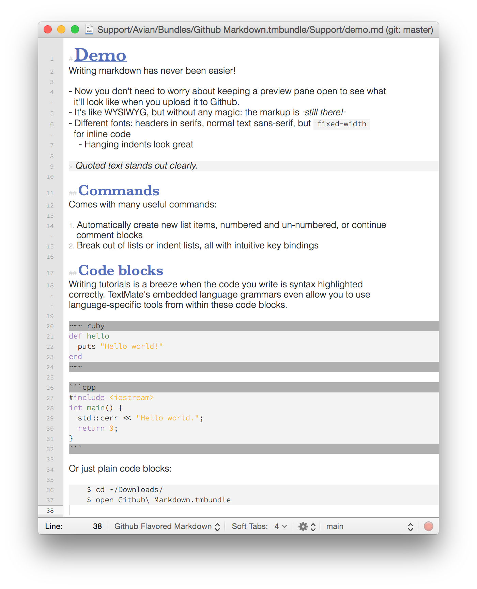

# Github Markdown for TextMate
This is my modified version of the Markdown bundle for TextMate 2 that combines a number of improvements to the language grammar and settings to improve the presentation of Github-flavored Markdown in TextMate. The aim is to provide an experience similar to viewing the final product in source form while editing, such as reducing the size of markup punctuation, changing fonts, and correctly applying syntax highlighting to code blocks.

## Example

## Installation
Clone the source or download and unzip, and double-click on the resulting file: `Github Markdown.tmbundle` to install the bundle. You may need to manually disable the old Markdown bundle by going to "Bundles -> Edit Bundles...", selecting "Markdown -> Language Grammars -> Markdown", and unchecking "Enable this item".
